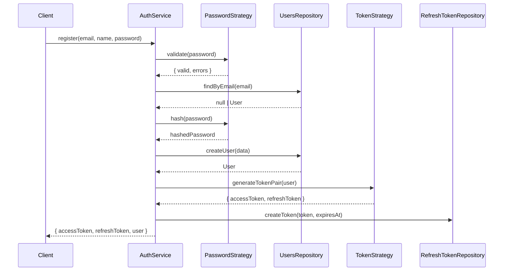
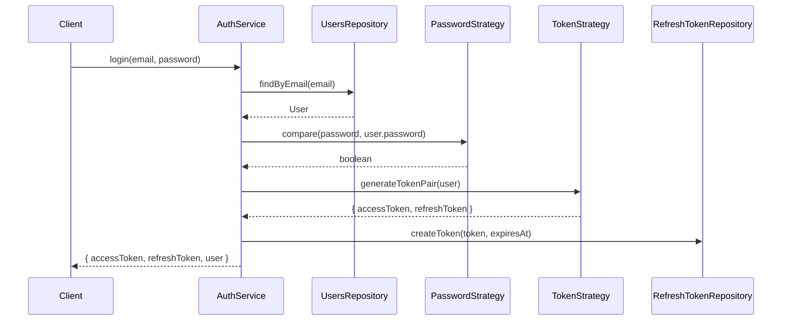
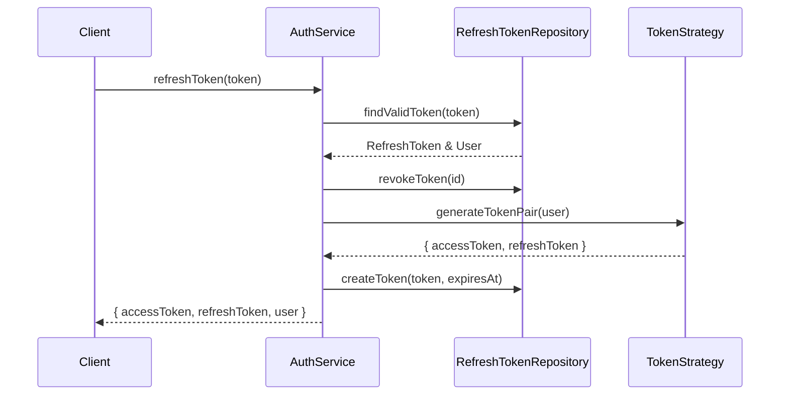

# Strategy Pattern - Authentication System

## 📋 Visão Geral

O sistema de autenticação foi refatorado utilizando o **Strategy Pattern** para separar responsabilidades e tornar o código mais testável, manutenível e extensível.

## 🎯 Objetivo

Anteriormente, o `AuthService` violava o **Single Responsibility Principle (SRP)**, pois era responsável por:
- Hash de senhas
- Validação de senhas
- Geração de tokens JWT
- Geração de refresh tokens
- Lógica de negócio de autenticação

Com o Strategy Pattern, cada responsabilidade foi isolada em sua própria estratégia.

## 🏗️ Estrutura

```
src/auth/
├── strategies/
│   ├── password.strategy.ts      # Estratégia para senhas
│   ├── token.strategy.ts         # Estratégia para tokens
│   └── jwt.strategy.ts           # Estratégia Passport JWT
├── services/
│   └── auth.service.ts           # Orquestração das estratégias
└── auth.module.ts                # Configuração e injeção
```

## 📦 Strategies Implementadas

### 1. PasswordStrategy

**Responsabilidade**: Gerenciar hashing e validação de senhas

```typescript
@Injectable()
export class PasswordStrategy {
  async hash(password: string): Promise<string>
  async compare(plainPassword: string, hashedPassword: string): Promise<boolean>
  validate(password: string): { valid: boolean; errors: string[] }
}
```

**Recursos**:
- ✅ Hash com bcrypt (10 rounds)
- ✅ Validação de força de senha:
  - Mínimo 8 caracteres
  - Pelo menos uma letra maiúscula
  - Pelo menos uma letra minúscula
  - Pelo menos um número
  - Pelo menos um caractere especial

**Uso**:
```typescript
// No AuthService
const hashedPassword = await this.passwordStrategy.hash(data.password);
const isValid = await this.passwordStrategy.compare(plainPassword, hashedPassword);
const validation = this.passwordStrategy.validate(password);
```

---

### 2. TokenStrategy

**Responsabilidade**: Gerenciar geração de tokens JWT e refresh tokens

```typescript
@Injectable()
export class TokenStrategy {
  generateAccessToken(user: User): string
  generateRefreshToken(): string
  generateTokenPair(user: User): TokenPair
  getRefreshTokenExpiry(): Date
}
```

**Recursos**:
- ✅ Geração de JWT access tokens com payload customizado
- ✅ Geração de refresh tokens usando UUID v4
- ✅ Configuração via environment variables:
  - `JWT_SECRET`: Chave secreta para assinar tokens
  - `JWT_EXPIRES_IN`: Tempo de expiração do access token (ex: "15m")
  - `REFRESH_TOKEN_EXPIRES_IN`: Tempo de expiração do refresh token (ex: "7d")

**Uso**:
```typescript
// No AuthService
const tokenPair = this.tokenStrategy.generateTokenPair(user);
// Retorna: { accessToken, refreshToken, expiresIn }

const expiresAt = this.tokenStrategy.getRefreshTokenExpiry();
```

---

### 3. JwtStrategy

**Responsabilidade**: Validar tokens JWT com Passport

```typescript
@Injectable()
export class JwtStrategy extends PassportStrategy(Strategy, 'jwt') {
  async validate(payload: JwtPayload): Promise<User>
}
```

**Recursos**:
- ✅ Integração com Passport.js
- ✅ Extração automática de tokens do header `Authorization: Bearer <token>`
- ✅ Validação de expiração
- ✅ Carregamento do usuário do banco de dados
- ✅ Verificação de usuário deletado

**Uso Automático**:
```typescript
// Em controllers
@UseGuards(JwtAuthGuard)
@Get('profile')
async getProfile(@Request() req) {
  return req.user; // Usuário já validado pela JwtStrategy
}
```

---

## 🔄 Fluxo de Autenticação

### Registro (Register)



### Login



### Refresh Token



---

## 🎨 Benefícios do Pattern

### 1. **Single Responsibility Principle**
Cada strategy tem uma única responsabilidade:
- `PasswordStrategy`: Apenas senhas
- `TokenStrategy`: Apenas tokens
- `JwtStrategy`: Apenas validação JWT
- `AuthService`: Apenas orquestração

### 2. **Open/Closed Principle**
Fácil adicionar novas estratégias sem modificar código existente:
```typescript
// Exemplo: Adicionar OAuth Strategy
@Injectable()
export class OAuthStrategy {
  async validateGoogle(token: string): Promise<User> { ... }
  async validateFacebook(token: string): Promise<User> { ... }
}
```

### 3. **Dependency Inversion Principle**
`AuthService` depende de abstrações (strategies), não de implementações concretas.

### 4. **Testabilidade**
Cada strategy pode ser testada isoladamente:
```typescript
describe('PasswordStrategy', () => {
  it('should hash password correctly', async () => {
    const strategy = new PasswordStrategy();
    const hashed = await strategy.hash('Test123!@#');
    expect(hashed).not.toBe('Test123!@#');
  });
});
```

### 5. **Reutilização**
Strategies podem ser usadas em outros serviços:
```typescript
@Injectable()
export class UserService {
  constructor(private readonly passwordStrategy: PasswordStrategy) {}
  
  async changePassword(userId: string, newPassword: string) {
    const hashed = await this.passwordStrategy.hash(newPassword);
    // ...
  }
}
```

---

## 🔧 Configuração

### Environment Variables

```env
# JWT Configuration
JWT_SECRET=your-super-secret-key-change-in-production
JWT_EXPIRES_IN=15m

# Refresh Token Configuration
REFRESH_TOKEN_EXPIRES_IN=7d
```

### Module Setup

```typescript
@Module({
  imports: [
    RepositoriesModule,
    PassportModule.register({ defaultStrategy: 'jwt' }),
    JwtModule.registerAsync({
      imports: [ConfigModule],
      inject: [ConfigService],
      useFactory: (config: ConfigService) => ({
        secret: config.get<string>('JWT_SECRET'),
        signOptions: {
          expiresIn: config.get<string>('JWT_EXPIRES_IN') || '15m',
        },
      }),
    }),
  ],
  providers: [
    AuthService,
    PasswordStrategy,
    TokenStrategy,
    JwtStrategy,
  ],
  exports: [AuthService, JwtModule, PassportModule],
})
export class AuthModule {}
```

---

## 🧪 Testes

### Testando PasswordStrategy

```typescript
describe('PasswordStrategy', () => {
  let strategy: PasswordStrategy;

  beforeEach(() => {
    strategy = new PasswordStrategy();
  });

  describe('hash', () => {
    it('should hash a password', async () => {
      const password = 'Test123!@#';
      const hashed = await strategy.hash(password);
      
      expect(hashed).toBeDefined();
      expect(hashed).not.toBe(password);
      expect(hashed.length).toBeGreaterThan(50);
    });
  });

  describe('compare', () => {
    it('should return true for valid password', async () => {
      const password = 'Test123!@#';
      const hashed = await strategy.hash(password);
      const isValid = await strategy.compare(password, hashed);
      
      expect(isValid).toBe(true);
    });

    it('should return false for invalid password', async () => {
      const password = 'Test123!@#';
      const hashed = await strategy.hash(password);
      const isValid = await strategy.compare('WrongPassword', hashed);
      
      expect(isValid).toBe(false);
    });
  });

  describe('validate', () => {
    it('should validate strong password', () => {
      const result = strategy.validate('Test123!@#');
      expect(result.valid).toBe(true);
      expect(result.errors).toHaveLength(0);
    });

    it('should reject weak password', () => {
      const result = strategy.validate('weak');
      expect(result.valid).toBe(false);
      expect(result.errors.length).toBeGreaterThan(0);
    });
  });
});
```

### Testando TokenStrategy

```typescript
describe('TokenStrategy', () => {
  let strategy: TokenStrategy;
  let jwtService: JwtService;
  let configService: ConfigService;

  beforeEach(() => {
    jwtService = new JwtService({ secret: 'test-secret' });
    configService = {
      get: jest.fn((key: string) => {
        if (key === 'JWT_EXPIRES_IN') return '15m';
        if (key === 'REFRESH_TOKEN_EXPIRES_IN') return '7d';
        return null;
      }),
    } as any;
    
    strategy = new TokenStrategy(jwtService, configService);
  });

  describe('generateAccessToken', () => {
    it('should generate a valid JWT', () => {
      const user = { id: '123', email: 'test@example.com' } as User;
      const token = strategy.generateAccessToken(user);
      
      expect(token).toBeDefined();
      expect(typeof token).toBe('string');
      
      const decoded = jwtService.verify(token);
      expect(decoded.sub).toBe(user.id);
      expect(decoded.email).toBe(user.email);
    });
  });

  describe('generateRefreshToken', () => {
    it('should generate a UUID', () => {
      const token = strategy.generateRefreshToken();
      
      expect(token).toBeDefined();
      expect(token).toMatch(/^[0-9a-f]{8}-[0-9a-f]{4}-4[0-9a-f]{3}-[89ab][0-9a-f]{3}-[0-9a-f]{12}$/i);
    });
  });
});
```

### Testando AuthService com Mocks

```typescript
describe('AuthService', () => {
  let service: AuthService;
  let usersRepo: jest.Mocked<UsersRepository>;
  let refreshTokenRepo: jest.Mocked<RefreshTokenRepository>;
  let passwordStrategy: jest.Mocked<PasswordStrategy>;
  let tokenStrategy: jest.Mocked<TokenStrategy>;

  beforeEach(() => {
    usersRepo = {
      findByEmail: jest.fn(),
      createUser: jest.fn(),
    } as any;

    refreshTokenRepo = {
      createToken: jest.fn(),
    } as any;

    passwordStrategy = {
      hash: jest.fn(),
      compare: jest.fn(),
      validate: jest.fn(),
    } as any;

    tokenStrategy = {
      generateTokenPair: jest.fn(),
      getRefreshTokenExpiry: jest.fn(),
    } as any;

    service = new AuthService(
      usersRepo,
      refreshTokenRepo,
      passwordStrategy,
      tokenStrategy,
      {} as any, // logger
    );
  });

  describe('register', () => {
    it('should register a new user successfully', async () => {
      const registerDto = {
        email: 'test@example.com',
        name: 'Test User',
        password: 'Test123!@#',
      };

      passwordStrategy.validate.mockReturnValue({ valid: true, errors: [] });
      usersRepo.findByEmail.mockResolvedValue(null);
      passwordStrategy.hash.mockResolvedValue('hashed-password');
      usersRepo.createUser.mockResolvedValue({
        id: '123',
        ...registerDto,
        password: 'hashed-password',
      } as any);
      tokenStrategy.generateTokenPair.mockReturnValue({
        accessToken: 'access-token',
        refreshToken: 'refresh-token',
        expiresIn: 900,
      });
      tokenStrategy.getRefreshTokenExpiry.mockReturnValue(new Date());

      const result = await service.register(registerDto);

      expect(result).toHaveProperty('accessToken');
      expect(result).toHaveProperty('refreshToken');
      expect(passwordStrategy.hash).toHaveBeenCalledWith(registerDto.password);
      expect(usersRepo.createUser).toHaveBeenCalled();
    });
  });
});
```

---

## 🚀 Próximos Passos

### Possíveis Melhorias

1. **OAuth Strategies**
   ```typescript
   @Injectable()
   export class GoogleStrategy extends PassportStrategy(Strategy, 'google') { ... }
   ```

2. **2FA Strategy**
   ```typescript
   @Injectable()
   export class TwoFactorStrategy {
     generateSecret(user: User): string
     verifyToken(secret: string, token: string): boolean
   }
   ```

3. **Rate Limiting Strategy**
   ```typescript
   @Injectable()
   export class RateLimitStrategy {
     checkLimit(userId: string, action: string): Promise<boolean>
   }
   ```

4. **Password Policy Strategy**
   ```typescript
   @Injectable()
   export class PasswordPolicyStrategy {
     enforce(password: string, policy: PasswordPolicy): ValidationResult
   }
   ```

---

## 📚 Referências

- [NestJS Authentication](https://docs.nestjs.com/security/authentication)
- [Passport.js Strategies](http://www.passportjs.org/packages/)
- [Strategy Pattern](https://refactoring.guru/design-patterns/strategy)
- [SOLID Principles](https://en.wikipedia.org/wiki/SOLID)

---

## ✅ Checklist de Implementação

- [x] PasswordStrategy criada
- [x] TokenStrategy criada
- [x] JwtStrategy criada
- [x] AuthService refatorado
- [x] AuthModule atualizado
- [x] Documentação criada
- [ ] Testes unitários para strategies
- [ ] Testes E2E atualizados
- [ ] Validação de environment variables
- [ ] Logging detalhado implementado

---

**Autor**: GitHub Copilot  
**Data**: 02/10/2025  
**Versão**: 1.0.0
